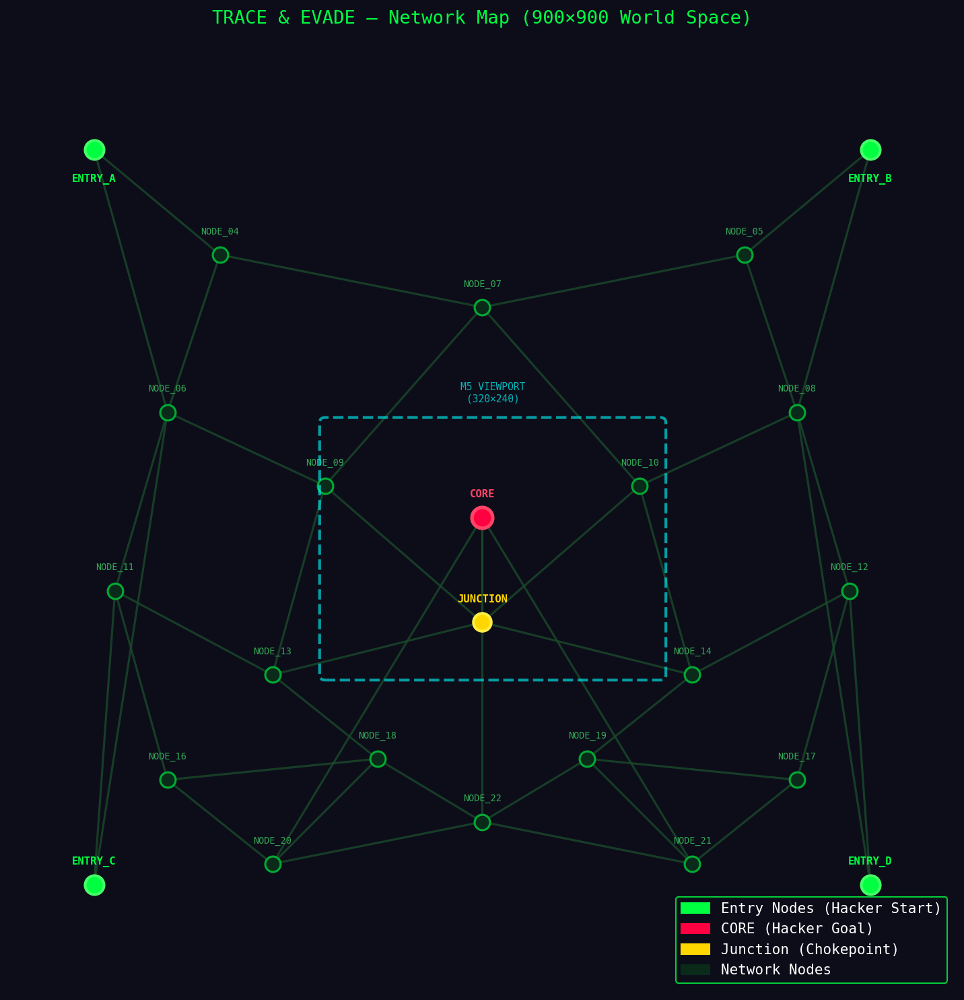

# 👾 TRACE & EVADE
### A Two-Player Hacker Strategy Game
**EGR 425 — Project 2 | Elijah & Diego | Spring 2026**
`M5Core2` × `Flutter` × `Bluetooth Low Energy`

---

## 1. Game Concept

Trace & Evade is a real-time two-player hacking-themed strategy game played across an **M5Core2 device** and a **Flutter mobile application** communicating exclusively over Bluetooth Low Energy (BLE). Inspired by the aesthetics of *Uplink* and *Watch Dogs*, the game pits a **Hacker** against a **Defender** in a tense race across a large scrolling network map.

The **Hacker** (phone) must navigate node-by-node through a network graph to reach the Core before being traced. The **Defender** (M5Core2) deploys trace programs to intercept the Hacker and lock down the network. Every move is synced in real-time over BLE, creating a fast-paced, reactive experience on both screens.

---

## 2. Player Roles

|  | 🟢 HACKER (Flutter Phone) | 🔴 DEFENDER (M5Core2) |
|---|---|---|
| **Objective** | Reach the CORE node at the center of the network | Deploy trace programs to catch the Hacker |
| **Win Condition** | Successfully navigates to the CORE node | Trace program reaches the Hacker's node |
| **Win Screen** | `ACCESS GRANTED ✓` | `TARGET TRACED ✓` |
| **Lose Screen** | `CONNECTION TERMINATED ✗` | `SYSTEM BREACHED ✗` |
| **Input Method** | Tap nodes on Flutter canvas to move | Touch screen to deploy traces & use tools |
| **Tools** | Spoof, Tunnel, Firewall Break | Speed Boost, Node Lock, Ping Scan |

---

## 3. Network Map & World Space

### Scrolling Viewport System

The full map lives in a **900×900 world space** — much larger than either device's physical screen. Both devices render a windowed **viewport** into this world that pans and follows the action smoothly.

```
FULL WORLD MAP (900 × 900px)
┌──────────────────────────────────────┐
│  ENTRY_A                   ENTRY_B   │
│                                      │
│       [node]        [node]           │
│            \        /                │
│    [node]---[JUNCTION]---[node]      │
│            /    |    \               │
│       [node]  [CORE]  [node]         │  ← camera follows
│            \    |    /               │     the action here
│    [node]---[node]---[node]          │
│                                      │
│  ENTRY_C                   ENTRY_D   │
└──────────────────────────────────────┘

         ┌─────────────┐
         │  M5 screen  │  320×240 viewport
         │  (viewport) │  pans smoothly
         └─────────────┘
```

**Camera behavior:**
- **M5Core2** — camera smoothly follows the Hacker's current node and nearby traces
- **Flutter** — camera follows the Hacker as they navigate, with smooth lerp animation
- Off-screen nodes are simply not drawn — no performance cost

### Node Layout (24 Nodes, 900×900 World Space)

```
ID   X    Y    Label         Role
──────────────────────────────────────────
0    80   800  ENTRY_A       Hacker start (bottom-left)
1    820  800  ENTRY_B       Hacker start (bottom-right)
2    80   100  ENTRY_C       Hacker start (top-left)
3    820  100  ENTRY_D       Hacker start (top-right)
4    200  700  NODE_04
5    700  700  NODE_05
6    150  550  NODE_06
7    450  650  NODE_07
8    750  550  NODE_08
9    300  480  NODE_09
10   600  480  NODE_10
11   100  380  NODE_11
12   800  380  NODE_12
13   250  300  NODE_13       Chokepoint (left)
14   650  300  NODE_14       Chokepoint (right)
15   450  350  JUNCTION      Central chokepoint — all paths converge
16   150  200  NODE_16
17   750  200  NODE_17
18   350  220  NODE_18
19   550  220  NODE_19
20   250  120  NODE_20
21   650  120  NODE_21
22   450  160  NODE_22
23   450  450  CORE          Hacker goal — center of map
```

### Edge Connections

All paths are diagonal/angled — no strict grid. Connections form a funnel shape that forces both players toward the center:

```
Outer ring:   (0,4)(0,6)(1,5)(1,8)(2,6)(2,11)(3,8)(3,12)
Mid-outer:    (4,6)(4,7)(5,7)(5,8)(6,11)(6,9)(7,9)(7,10)(8,10)(8,12)
Mid layer:    (9,13)(9,15)(10,14)(10,15)(11,13)(11,16)(12,14)(12,17)
Chokepoints:  (13,15)(13,18)(14,15)(14,19)(15,23)
Upper paths:  (16,18)(16,20)(17,19)(17,21)(18,22)(19,22)(20,22)(21,22)
Upper→CORE:   (20,23)(21,23)(22,23)
```

### Map Preview



### Strategic Design
- **4 Entry Points** — Hacker picks a corner to start; Defender must guess where to concentrate traces
- **1 Central JUNCTION** — all paths converge here, creating a natural showdown point
- **CORE connects to 4 nodes** — multiple final approaches keep the endgame tense
- **Diagonal paths** — no Manhattan movement; paths feel organic and unpredictable
- **Dead ends and loops** — Hacker can backtrack to mislead the Defender

---

## 4. Game Loop

### Turn Structure
- Hacker taps an adjacent node on the phone to move
- Move is sent over BLE to M5Core2 instantly
- M5Core2 updates the shared map and advances trace programs
- Updated trace positions are sent back to the phone over BLE
- Both screens pan their cameras smoothly to follow the action
- Both screens reflect the new state in near real-time

### Win / Loss Conditions

| Event | Condition | Phone Display | M5 Display |
|---|---|---|---|
| Hacker Wins | Hacker reaches CORE node | `ACCESS GRANTED ✓` | `SYSTEM BREACHED ✗` |
| Defender Wins | Trace occupies Hacker's node | `CONNECTION TERMINATED ✗` | `TARGET TRACED ✓` |
| Defender Wins | Game timer expires | `SESSION EXPIRED ✗` | `TRACE COMPLETE ✓` |

---

## 5. Bluetooth Architecture

The **M5Core2 acts as the BLE Server**, exposing a single GATT service with two characteristics for true bidirectional communication. The **Flutter app acts as the BLE Client**.

```
M5Core2 (BLE Server)                  Flutter Phone (BLE Client)
┌─────────────────────────┐           ┌──────────────────────────┐
│ SERVICE UUID            │           │                          │
│                         │           │   Scans & connects       │
│  CHAR_DEFENDER (NOTIFY) ├──────────▶│   Reads defender state   │
│  Traces, timer, locks   │           │                          │
│                         │           │                          │
│  CHAR_HACKER (WRITE)    │◀──────────┤   Writes hacker moves    │
│  Node ID, tools         │           │   & tool usage           │
└─────────────────────────┘           └──────────────────────────┘
```

### UUIDs
```cpp
#define SERVICE_UUID       "4fafc201-1fb5-459e-8fcc-c5c9c331914b"
#define CHAR_DEFENDER_UUID "beb5483e-36e1-4688-b7f5-ea07361b26a8"  // NOTIFY
#define CHAR_HACKER_UUID   "beb5483e-36e1-4688-b7f5-ea07361b26a9"  // WRITE
```

### BLE Payloads (JSON)

**Phone → M5** (Hacker move):
```json
{ "nodeId": 15, "tool": "spoof", "toolsLeft": [2, 1, 1] }
```

**M5 → Phone** (Defender state):
```json
{ "traces": [9, 13, 15], "locked": [7], "ping": false, "timeLeft": 42 }
```

> Node IDs are used instead of raw coordinates — smaller payload, faster transfer, unambiguous.

---

## 6. Camera / Viewport System

### World Space → Screen Space

```cpp
// M5Core2: convert world coords to screen coords using camera offset
int screenX = (int)(node.worldX - cameraX);
int screenY = (int)(node.worldY - cameraY);

// Only draw if node is within the visible viewport
if (screenX >= 0 && screenX <= 320 && screenY >= 0 && screenY <= 240) {
    M5.Lcd.fillCircle(screenX, screenY, NODE_RADIUS, GREEN);
}
```

### Smooth Camera Follow (Lerp)

```cpp
// M5Core2 — camera smoothly lerps toward the hacker's node
float targetCamX = hackerNode.worldX - SCREEN_W / 2.0f;
float targetCamY = hackerNode.worldY - SCREEN_H / 2.0f;
cameraX += (targetCamX - cameraX) * 0.15f;
cameraY += (targetCamY - cameraY) * 0.15f;
```

```dart
// Flutter — animated camera pan using AnimationController
_animController = AnimationController(
  vsync: this, duration: const Duration(milliseconds: 300));
_camX = Tween<double>(begin: _camX.value, end: targetX)
  .animate(CurvedAnimation(parent: _animController, curve: Curves.easeInOut));
_animController.forward(from: 0);
```

---

## 7. Technology Stack

| Component | Technology | Role |
|---|---|---|
| M5Core2 Firmware | PlatformIO / Arduino C++ | BLE Server, game logic, TFT map rendering |
| Mobile App | Flutter (Dart) | BLE Client, Hacker UI, Canvas map rendering |
| BLE Library (Phone) | `flutter_blue_plus` | Scan, connect, read/write/notify characteristics |
| BLE Library (M5) | ESP32 BLE Arduino | GATT server, characteristic callbacks |
| Communication | Bluetooth Low Energy | Bidirectional JSON payloads — NOTIFY + WRITE |
| Map Rendering (M5) | M5GFX / TFT | Scrolling viewport with camera offset math |
| Map Rendering (Phone) | Flutter CustomPainter | Animated panning canvas with tap-to-move |

---

## 8. Requirements Coverage

| Requirement | How We Meet It |
|---|---|
| Two-device gameplay | M5Core2 (Defender) + Flutter Phone (Hacker) — each with a distinct role and UI |
| BLE: D1 → D2 | M5Core2 NOTIFY characteristic pushes trace/timer data to Flutter on every state change |
| BLE: D2 → D1 | Flutter WRITE characteristic sends Hacker node ID and tool usage to M5Core2 on every move |
| Synced game state | Every move triggers immediate BLE update; both screens reflect same map with minimal lag |
| Touch screen (both) | Flutter: tap nodes to navigate. M5Core2: touch to deploy traces and activate tools |
| Differing game over screens | Phone: `ACCESS GRANTED` or `CONNECTION TERMINATED`. M5: `SYSTEM BREACHED` or `TARGET TRACED` |
| Challenge & complexity | 24-node scrolling map, angled paths, smooth camera, asymmetric tools, real-time BLE sync |

---

## 9. Development Plan

| Phase | Task | Owner |
|---|---|---|
| 1 | Define shared node/edge data structure used by both M5 and Flutter | Both |
| 2 | Static map renders on M5 TFT with camera offset math | Elijah |
| 3 | Static map renders on Flutter Canvas with tap detection on nodes | Diego |
| 4 | BLE connection established — Flutter connects to M5Core2 GATT server | Both |
| 5 | Hacker movement syncs from phone to M5 via BLE WRITE; camera follows | Diego |
| 6 | Defender deploys traces on M5, syncs to phone via BLE NOTIFY | Elijah |
| 7 | Smooth camera lerp/pan implemented on both devices | Both |
| 8 | Tool abilities implemented on both devices | Both |
| 9 | Win/loss detection and game over screens finalized | Both |
| 10 | Polish — animations, terminal aesthetic, BLE stress testing | Both |

---

## 10. Why This Project Stands Out

- **Scrolling world map** — 900×900 world space with smooth panning camera on both devices
- **Irregular angled graph** — 24 nodes with diagonal paths, chokepoints, and dead ends; no boring grid
- **Unique concept** — hacking-themed strategy game with strong cyberpunk visual identity
- **High BLE complexity** — node ID payloads, trace arrays, tool states, and timer all synced bidirectionally
- **True two-player asymmetry** — each device has a completely different role, UI, and toolset
- **Real-time responsiveness** — every tap immediately triggers a BLE sync with smooth camera follow
- **Clear, unambiguous game over screens** that differ meaningfully between both devices

---

*EGR 425 — Project 3 Proposal | Elijah & Diego | Spring 2026*
